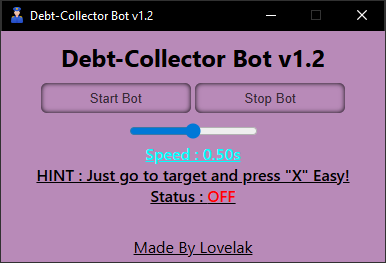

# Debt-Collector Bot v1.2

Debt-Collector Bot is a desktop automation tool with a simple webview interface, designed to automate keypress sequences for debt collector Job in **Grand RP**. The bot listens for the `X` key and simulates a series of keypresses (`g`, `3`, `4`, `8`) The UI is built with HTML/CSS and integrated into a Python app using [pywebview](https://pywebview.flowrl.com/).

## Features

- **Start/Stop Bot**: Control the automation from a modern, user-friendly interface.
- **Hotkey Activation**: Press `X` to trigger the keypress sequence.
- **Status Display**: Visual feedback for bot status (ON/OFF).
- **Voice Warning**: If you try to stop the bot when it's not running, you'll hear a spoken warning.
- **Customizable UI**: Stylish, responsive design with helpful hints.
- **Adjusable Speed**: Now you can set your interaction speed ether faster or slower.

# Preview



## How It Use?

1. Launch the app.
2. Set the Speed of your choice.
3. Click **Start Bot** in the window.
4. Go to your target and press **`X`** to collect Debt.
5. Click **Stop Bot** to stop automation.

## Installation

1. **Clone the repository:**
   ```sh
   git clone https://github.com/lovelak-pro/grandrp-debtBot.git
   cd grandrp-debtBot
   ```
2. **Install dependencies:**
   ```sh
   pip install pywebview pyautogui keyboard pyttsx3
   ```
3. **Run the bot:**
   ```sh
   python main.py
   ```

## Requirements

- Python 3.7+
- Windows OS (for keyboard and pyautogui compatibility)
- [pywebview](https://pywebview.flowrl.com/)
- [pyautogui](https://pyautogui.readthedocs.io/en/latest/)
- [keyboard](https://github.com/boppreh/keyboard)
- [pyttsx3](https://pyttsx3.readthedocs.io/en/latest/)

## Usage Notes

- The bot simulates keypresses globally. Make sure your target application is focused.
- The hotkey ('X') is hardcoded. You can change it in `main.py` if needed.
- The UI is served from `src/index.html` and styled with CSS.

## Credits

### Made by [Lovelak](https://lovelak.rf.gd)

---

**Disclaimer:** Use responsibly. Anything happens to your **Grand RP** Account is on you this bot is only for educational purposes.
